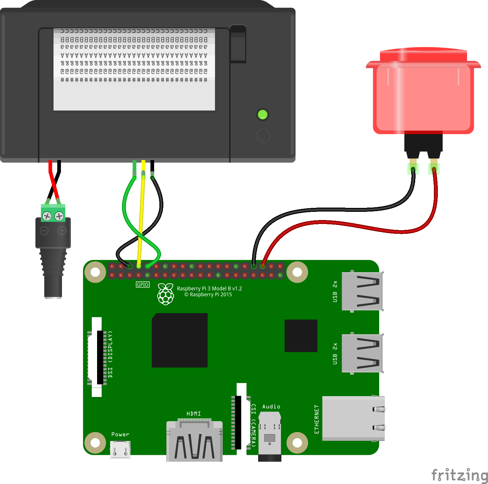

# Raspberry Pi maze printer

Run `python main-script.py`

The script will wait for button events (GPIO pin 16).

### Button tap
Runs the script `mazy.py` which, using [Recursive Backtracking](https://en.wikipedia.org/wiki/Maze_generation_algorithm#Recursive_backtracker), generates a random maze and saves it as `maze.png` on disk.

`printer.py` is executed next, which takes and image from disk and sends it over to the thermal printer.

### Button hold (> 2 sec)
Shuts down the Raspberry Pi

## Circuit

